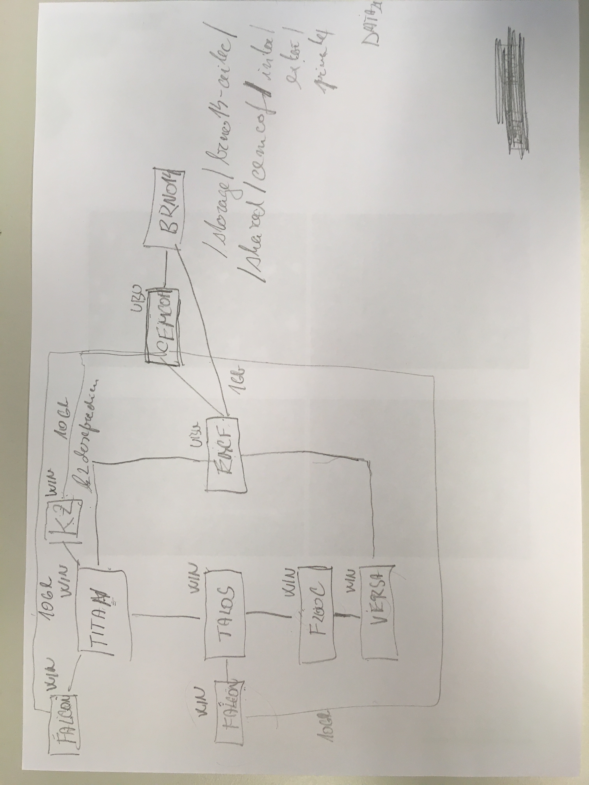

obecne - formatovani (pro vsechny taby):

- User/affiliation: zarovnat doleva (pod Email, pole roztahnout na cely levy frame)
- User/identifier: zarovnat doleva (pod Affiliation)
- Job/Clean: zmenit nazev na "Remove all data from the microscope after job termination" a presunout tickbox do leveho sloupce pod vsechny ostatni vstupy. Pridat tento tickbox i do Data transfer, defaultni hodnota - aktivni (zaskrkly)
- Pixel Size -> Pixel size A/px
- Frame dose -> FrameDose e/A^2
- Defocus Range Min -> Defocus min. A
- Defocus Range Max -> Defocus max. A
- kV -> Voltage kV
- cs -> Cs mm 
 
obecne - preklepy (pro vetsinu tabu):

- Phaser plate -> Phase plate (default unticked)
default hodnoty:

Talos Arctica:
- Pizel size - 1.23 pro SPA, 3.5 pro Tomo (povoleny rozsah - 0 - 100)
- Frame dose - 1.0 (povoleny rozsah 0 - 100)
- Defocus min. - 10000 (povoleny rozsah 0 - 1 000 000)
- Defocus max. - 35000 (povoleny rozsah 0 - 1 000 000)
- Voltage - 200 (povoleny rozsah 40-200)
- Cs - 2.7 (nelze menit)

Titan Krios

- Pixel size - 0.818 pro SPA, 3.473 pro Tomo (povoleny rozsah - 0 - 100)
- Frame dose - 1.0 (povoleny rozsah 0 - 100)
- Defocus min. - 7000 (povoleny rozsah 0 - 1 000 000)
- Defocus max. - 28000 (povoleny rozsah 0 - 1 000 000)
- Voltage - 300 (povoleny rozsah 60-300)
- Cs - 2.7 (nelze menit)
 
Talos F200C

- Pixel size - 1.598 pro SPA, 5.311 pro Tomo (povoleny rozsah - 0 - 100)
- Frame dose - 1.0 (povoleny rozsah 0 - 100)
- Defocus min. - 18000 (povoleny rozsah 0 - 1 000 000)
- Defocus max. - 40000 (povoleny rozsah 0 - 1 000 000)
- Voltage - 200 (povoleny rozsah 40-200)
- Cs - 2.7 (nelze menit)

