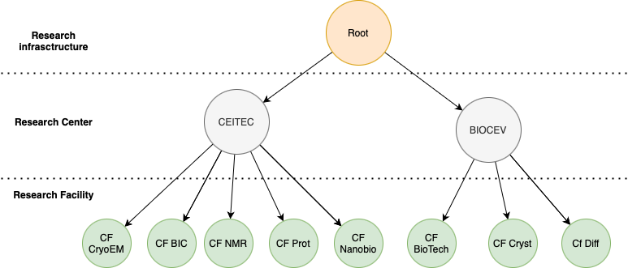
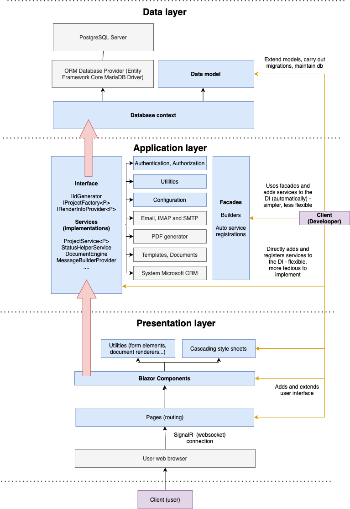
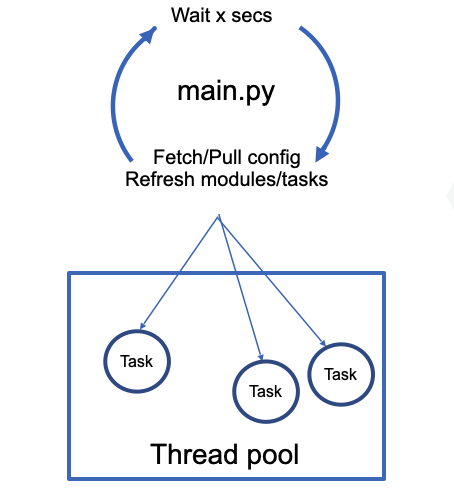

# SIP - technical documentation

SIP (Scientific data integration platform) is a web-based application used for facilitation and automation of workflow and administration
of scientific facilities.

Main goal of this guide is to firstly describe an architecture of the application, identify it's concepts
and areas.

When this is understood, we will go through the process of setting up, configuring and deploying the application at a facility.

Ultimately, we will elaborate on how to further develop and extend the application with features required by specific facility.

## Part 1 - Features, concepts and architecture

The system can be seen as consisting of three major areas:
- Project management (administrative)
- Facility overview (informative)
- Data management (executive, processing)

### Common concepts

Some of the features shared by these areas are the following, with more detailed description below:

- **User store**. Authentication of internal application users via external providers (Saml2, Google, orcid)
- **Organization hierarchy**
- **Research center (network) infrastructure**
- **Emails.** Both incoming and outgoing. Automatic system emails triggered by the workflow. Storing emails in threads.
- **Documents.** Support for storing, generating and sending documents with variety of formats.
  Conversion of HTML documents to PDF, templating .docx files.


#### Organizations

The system supports multiple "organizations", each separately configured, but handled by a single deployment unit.
Organization in the system maps to real-life organization, such as research center, research facility, university, etc.
Definition of an organization in the system contains information about the organization, such as name, abbreviation, unique identifier
and optionally it's child organizations, which enables creating hierarchical organization structure.

A real example of defined Organization structure can bee seen in the following image:



#### Centers

All use cases of SIP cannot be implemented by the webserver only. 
The research facility is expected to have it's own internal network and computers, 
where other modules of the system must be deployed to cover some of the features of the facility (e.g. data transfering from 
instruments, remote access to instruments...). The webserver is then understood
as a central unit that offers internal API to the separate modules of the facility.

In the nomenclature of the system, the facility itself understood by the webserver is just an organization, 
but the whole internal facility infrastructure is called "center".

Each center than maps to its organization on the webserver, using the API and authenticating itself 
with a secret key.


The center is however optional - to only cover use cases related to administrative project management,
it is sufficient to configure only organization on the webserver without actually deploying any other modules in the facility.  

#### Users & Authentication

SIP keeps internal store of the users. By privileged users, other users and their roles within the organizations are 
managed. The system supports multiple authentication providers, such as Google or ORCID, with a possibility to implement more.
However, these providers are just identities and must be mapped to the actual user within the system. That user is
then assigned roles and used for authorization process.
Using external identity for the first time therefore creates a new internal user with no permissions, which are then assigned 
later by a privileged user. 
However, attaching external logins to existing internal users is possible through email invitation links.

**Role** is an important entity that can be assigned to a user and gives the user certain meaning within the system.
Roles are assigned in pair with an organization, which enables one user to have different roles in different organizations.

The role/organization pairs are then used through the system for authorization and GUI rendering purposes.

The actual meanings of the roles and the application behaviour related to them is not generally implemented 
and their definition for the facility needs is up to the developer deploying the system.

### Project management features

The system is designed to be used for administrative project management.
Some of the features are:

- **Projects** and statuses.
- **Workflows.** Configuring how each project type for each organization reacts to the events, such as email receive or daily check.
- **Proposals** and their evaluations.

#### TODO - Projects, statuses, documents and emails

These entities are always needed in this area and therefore are implemented in the core of the system.

The most important thing is **organization-project-status** relation.

A **project** goes through a lifecycle and during this
process it alter's it's status, either automatically (e.g. recieving an email, deadline expiration...) or
or through user's or administrator's intervention.
The project can be in any predefined status for any predefined organization.

The projects are obviously also related to the users. While the
relationship between user and organization is called a role, the relationship between user and project is called
a membership. Membership can be also optionally scoped to a specific organization.
Similarly to roles, membership types existing in the system are predefined by the developer.

During lifecycle of the project
arbitrary **documents** can be attached to it. The system implements tooling related to documents, such as
generating PDFs from HTML, templating .docx files, sending email attachments, etc.

**Document** is related to specific project and organization and contains it's primary file and attachments.

**Proposal** is a special type of document that extends it with information such as who
created the document, who should evaluate it, when it was evaluated, in which state it is, etc.
Also, custom GUI components for rendering the proposal and it's evaluation form are attached to the proposals.

For example, **project proposal** can be a document that is submitted by a user through a custom web form and that
triggers creation of new project. Afterward **technical feasibility proposals** are documents that are sent
to the facility heads for evaluation.


The email support is also important part of the system.
The system can not only emit emails to the users, but receive emails, parse them and attach them to the project, which enables
reacting to them for example by changing status of the project, which might be a required
feature for the custom project lifecycle.


Although base and abstract implementation of the projects and statuses is part ot the system,
specific required project types, their statuses and workflows are predefined by the developer.


### Facility overview features

TODO - dewars, planningboard etc, remote access. 

### Data management features

In a facility network, there are several instruments that produce data. 
A dataset produced by an instrument can undergo any of the **data lifecycles**, implemented by SIP.
The data can be transfered and processed on-the-fly during the user's session on the instrument.
One session and it's resulting dataset is called **experiment** and it's processing session is called **job**.

Experiment always happens on a specific **instrument** and has a specific **technique**. 
Available instruments and techniques are preconfigured by the facility. 
Each instrument/technique pair have it's own data lifecycle configuration and it's own processing workflows. 

Before launching an experiment, user must use the SIP web interface to set up the experiment, 
which includes selecting the instrument, technique, operator, data folder and other parameters.

Common data model shared by all experiment techniques and instruments include: 
- **Operator** - a person who does and is responsible for the experiment
- **User** - for whom the experiment is done, the data owner. Can be same as the operator.
- **Sample** - subject of the experiment
- **Project** - optional project, for experiment grouping purposes

The rest can be fully configured by the facility (by providing default values, determining what can be set by the user from interface etc):
- **Data lifecycle properties** - whether to archive/publish data, which storage/processing engine to use...
- **Processing workflows** - how and where to process the raw data transfered from the instrument. Processing workflows are either
configured manually or can be provided from an external source - **workflowhub.eu** 


#### Experiment metadata

Each experiment and it's dataset is always accompanied by it's metadata, which is a single and simple `yaml` file with 
key-value pairs. Metadata values can be collected from three sources: 

- **SIP experiment data** - data specified in GUI when creating experiment, such as operator, user, project name, sample name...
- **Processing engine data (workflow data)** - facility specific, in case of cryo-em, for example `pixelSize`, `minDefocus`...
- **Instrument data** - a file that can be generated by the instrument or a supporting script running with it. Such file should be put 
in the source folder, where instrument is generating data for the experiment. It then gets loaded by the lifecycle engine and key-values are added to the resulting metadata file.

What metadata there are and from which source they come is configurable for each instrument/technique on the facility. 


Internally the data management is split into three major parts:
- **Storage engine**
- **Processing engine**
- **Publication engine**

TOD

### Technical overview

SIP software is is split into two major parts:

- **Webserver** - the main, mandatory central element of the system developed in `C# .NET` 
Only a single instance of webserver is expected to be deployed for a facility. 
In addition, more facilities can share a single webserver instance.
Webserver should be accessible from the internet.
- **Node** - a smaller part of SIP developed in `Python`. Zero or more instances of nodes can be deployed and configured throughout 
the facility. What each node actually does depends on it's configuration. 
Each node should be able to reach the webserver through network in a client role - initiates HTTP connections, but does not have to listen for them.

The nodes communicate with the webserver through the REST API. 
The webserver is the central unit and the nodes do not communicate with each other.

The important concept is something that could be called **shared center configuration**.

Each center/facility/organization has it's own configuration file. It is a YAML file
configuring not only all the nodes in the center, but also all settings scoped to the single organization.

This file can be located anywhere in the facility network and can be consumed by any node or the webserver itself.
Other infrastructure nodes connected to the webserver then fetch the configuration files and set up themselves according to it.

#### Webserver internal architecture

The webserver part of the system can be seen as separated to three major layers. The data layer contains data classes that are mapped to the relational database using ORM framework.
It is therefore responsible for data persistence. The application layer works with the data layer . The application layer essentially contains everything that is
not related to data persistence, data modelling and graphical user interface.
The presentation layer is responsible for displaying graphical user interface to the user.
To put it simply, data layer models and stores data of the system.
The application layer performs all operations on the data.
The presentation layer presents the data to the user and enables user to interact with the application layer using GUI.





#### Node internal architecture

LIMS node is implemented in Python and is portable (e.g. Win7 runs node in microscope network, Linux on processing nodes).

All nodes share common codebase with common features, such as: 
- Connecing to central SIP webserver API
- Loading/Submitting facility (center) configration
- Dynamically running tasks (modules) that are configured for given node

SIP Node can be extended by arbitrary features required by the facility (e.g. submitting instrument status and displaying it to the users via web GUI).

The node is expected to be run permanently (as a systemd service, for example) and utilizes multiple threads to function.
Main thread runs in infinite loop and responsible for syncing configuration, pinging webserver and running independent configured tasks/modules
on other threads.

The architecture described above is shown in the following diagram:



The node can be run in two modes, either as facility configuration provider (max one instance, or SIP webserver itself) or 
as a standard node, that connects to the webserver and fetches the configuration from it.

## Part 2 - Installation and setup

Before configuration, one must get familiar with [YAML](https://yaml.org) serialization format.

SIP webserver runs on [`.NET 8` from Microsoft.](https://dotnet.microsoft.com/download/dotnet/8.0). 
SIP does not support docker deployment yet and the following guide assumes deployment on a Linux server.


- Install opensource [`.NET 8 SDK`](https://dotnet.microsoft.com/download/dotnet/8.0)
- Install opensource [`PostgreSQL` database](https://www.postgresql.org).
- Set up a database user in `PostgreSQL` with enough permissions, do this by authenticating as `postgres` user, 
creating a new user and granting it permissions to create databases.

  ```sudo -u postgres psql -c "CREATE USER sip WITH PASSWORD '********';"``` 

  ```sudo -u postgres psql -c "ALTER USER sip WITH CREATEDB;"```

- Optional: If postgres database should accept connection from external network, edit `postgresql.conf` and set `listen_addresses = '*'`. Then edit `pg_hba.conf` and add `host all all`
- Do minimal required SIP web application configuration as described in section below. Then continue here.
- Set up database tables using following commands:

  `dotnet tool install --global dotnet-ef` if not already installed 

  `dotnet ef database update -- --environment <your_env>`

- If using systemd, adjust and install `systemd` service file from template [sip.service](sip.service). Here specify path to dotnet binary, path to published application (working directory) and a user that will run the process.
- Before launching the server, ensure it has enough priviledges to bind to the configured ports. 
- Standard HTTP(S) ports are priviledged. See <https://stackoverflow.com/questions/413807/is-there-a-way-for-non-root-processes-to-bind-to-privileged-ports-on-linux>

### Webserver setup & configuration

SIP is designed so that platform, network and facility specific properties are all stored in a single configuration file.
Most of the system parts take it's specific configuration from that file, however, adjusting the system for more specific needs
will at some point require deeper extension in the codebase.

Use given configuration template [sip_server_config_template.yml](sip_server_config_template.yml), make a copy it 
and name it `appsettings.<environment>.yml`, where `<environment>` is name of environment under which the webserver
is running, one of: `Production`, `Staging`, `Development`. Default is 
`Development` and can be set explicitly by `--environment` argument or `ASPNETCORE_ENVIRONMENT` environment variable. 
Such file name and location will be automatically loaded, however, entirely custom
file path can be given as a command line argument `--appsettings <filepath>` to the webserver.

Configuration necessary for minimal function (such that webserver does not crash on start) is following:

- **Connect to the database** - set up under `Db` key in config file.
- **Set up the server endpoints** - under `Kestrel` key in config file - where the server will listen, where are https certificates.
- **Set up application basic information** - under `App` key in config file - name, abbreviation, etc.

Follow comments in the configuration file and set up other stuff as needed. 


### Facility setup & nodes configuration

First it is needed to be decided where to put the configuration file for the facility. It can be anywhere where one of
deployed sip-nodes can read it, or it can be left on the original location and read by the webserver itself.
Copy template to desired location [sip_center_config_template.yml](sip_center_config_template.yml) and name give it new name, for example `sip_<your-facilityname>_config.yml`.

This file is separated from the webserver configuration file and contains only the configuration specific to the facility. 
The SIP webserver supports multiple facilities at the same time and therefore multiple such files can exist.

Facilities (centers) the webserver knows about and accepts are defined under `Centers` section in the **webserver configuration** file.
```yaml
Centers:
  - Id: <facility_id> # Short unique facility identifier that never changes
    Key: <secret_key> # Secret key of the center for authentication purposes during API calls (put here any random string) 
    ConfigFile: <path> # OPTIONAL path to the configuration file of the center
    
# NOTE: ConfigFile path can be ommited if such configuration is proveded by one of the sip-nodes
```

Minimal configuration of the facility configuration file is following:

- **SIP webserver connection** - how to connect to the webserver (API url and key), under `SipApi` key in config file.
- **Facility basic information** - name, abbreviation, id... under `Center` key in config file.

#### Nodes and modules

More sip-nodes can be utilized by the facility.
What should they do, where they are and how they are configured is defined in the facility configuration file.
After fetching this file, each `sip-node` loads the configured modules and runs the specified actions for it in specified intervals.
Without this configuration, the `sip-node` instance will do nothing but pinging the webserver. Focus on the `Nodes` section in 
the file to set it up.

Follow comments in the configuration file and set up other stuff as needed. Since the file can get quite big and messy,
it is recommended to get familiar with YAML's less known features such as *anchors* and *references* to keep the configuration
more maintainable.

To deploy the node, clone [sip-node](https://github.com/cemcof/sip-node) repository, install requirements and 
configure underlying machine's environment.

Node can be run in two modes, depending whether it is the node that provides facility configuration file or not.
If node is not config provider, arguments that enable it to connect to the webserver must be given: *organization name*,
*sip api url* and *sip api key*.

```shell
# As config-providing node
python3 main.py --config-file <path_to_config_file.yml>

# As standard node
python3 main.py -o <organization_name> --sip-api-url <sip_api_url> --sip-api-key <sip_api_center_secret> 
```

## Part 3 - Adaptation, extension and development

Before deploying and using the system, developer must define and configure the concepts described above.
However, the one doing this must be familiar with several areas related to software development and web.

For configuring and deploying the system according to following manual, only basic knowledge of these areas will suffice.
However, for actually extending the system with new features, deeper understanding and more experience in these ares will be necessary.

This manual does not cover this, but includes links to relevant documentation and resources.

- .NET 8 and C# - syntax, basic concepts and usage 
- OOP (object oriented programming) - concepts like classes, interfaces, inheritance, polymorphism, methods, etc.
- YAML
- [ASP.NET Core framework](https://docs.microsoft.com/en-us/aspnet/core/?view=aspnetcore-5.0)
- [Entity Framework Core](https://docs.microsoft.com/en-us/ef/core/)
- Python, if centers and lims nodes are required


### Define the organization tree

TODO 

### Define index redirecting 

When user opens the webpage, redirection to a URL relevant to the user should happen. 
This typically depends on the role within the system. 
For example, project administrator will probably want to see the list of projects, whereas lab operator will be
be interested in data transfer from microscopes. Unauthenticated user should be redirected to the login page, etc.

This can be configured by implementing `IIndexRedirector` interface and registering it in the DI container.

TODO

### Define the user roles

TODO 

### Define the project types and statuses

TODO 

### Useful curl requests

To use these requests, set `$apikey` with the valid API key and `$expid` with the desired experiment ID.

```bash
# Request data expiration for an experiment
curl -X PATCH --location "https://condenser.ceitec.muni.cz/api/experiments/$expid" \
-H "Lims-Organization: $apikey" \
-H "Content-Type: application/jsonpatch+json" \
-d '{"op":"replace","path":"/Storage/State","value":"ExpirationRequested"}'
```

```bash
# Request data archivation for an experiment
curl -X PATCH --location "https://condenser.ceitec.muni.cz/api/experiments/$expid" \
-H "Lims-Organization: $apikey" \
-H "Content-Type: application/jsonpatch+json" \
-d '{"op":"replace","path":"/Storage/State","value":"ArchivationRequested"}'
```

```bash
# Get experiments
curl -X GET --location "https://condenser.ceitec.muni.cz/api/experiments" \
-H "Lims-Organization: $apikey"
```

```bash
```